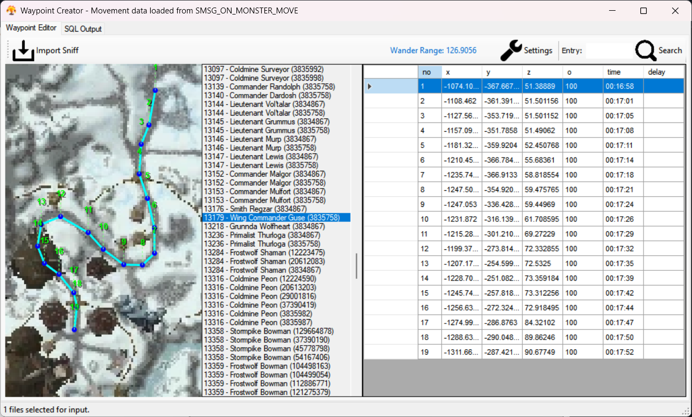

#  Mass Waypoint Creator

Fork of Waypoint Creator with main focus on handling large sniffs better.

Creates NPC paths using parsed packet files and visualizes them on the game map with SkiaSharp rendering.

## Features

- **Map Visualization**: View waypoints on game maps using SkiaSharp
- **Multi-Server Support**: VMaNGOS, TrinityCore, and CMaNGOS SQL output
- **Database Integration**: Auto-fetch creature names from your database
- **Search**: Find NPCs by searching for names or NPC entries
- **Map Navigation**: Zoom and pan around the game world
- **Multi-file Support**: Process multiple sniff files simultaneously

## Requirements

- Parsed packet files from WowPacketParser
- Map files in same directory as executable  
Maps for vanilla:
https://drive.google.com/uc?export=download&id=1SJLoBiyreFb6O5r4EwlDf_PdfmI3t1Zx   
Maps for tbc/wotlk:
https://drive.google.com/uc?export=download&id=1Cw0vKgVWV_RRdHoDODLVPxEr7ABlk_4i  
If you wish to convert maps on your own, follow tutorial:
https://gist.github.com/Daribon/fef11759ead63be0f90ccabe12fff960
- Database connection (optional, for creature names)
- Windows 7+

## Output Support

- VMaNGOS (`creature_movement`)
- TrinityCore (`waypoint_path`)
- CMaNGOS (`creature_movement`)
- C++ code generation

